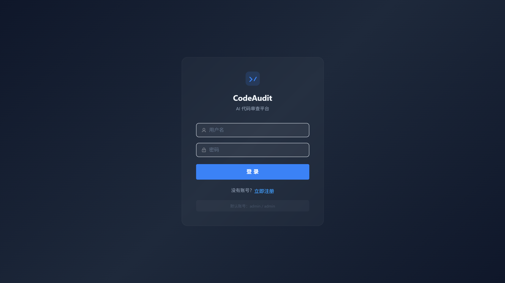
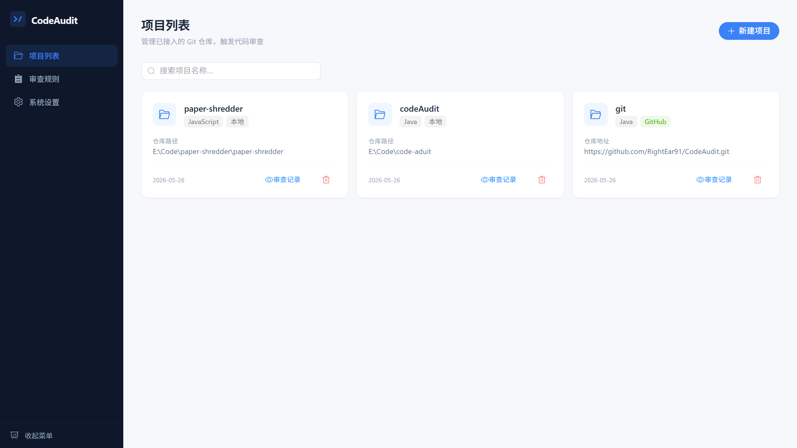
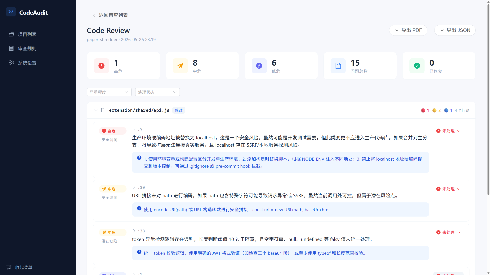
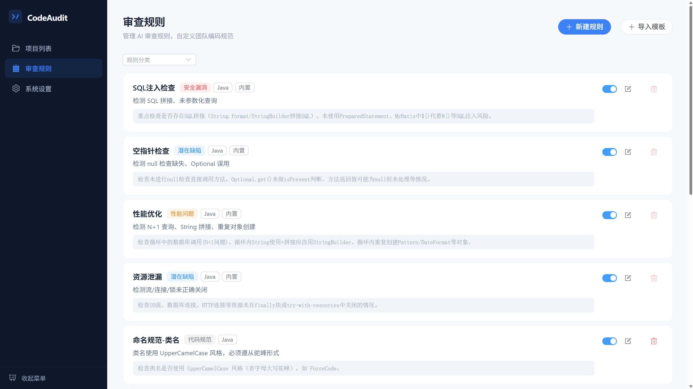
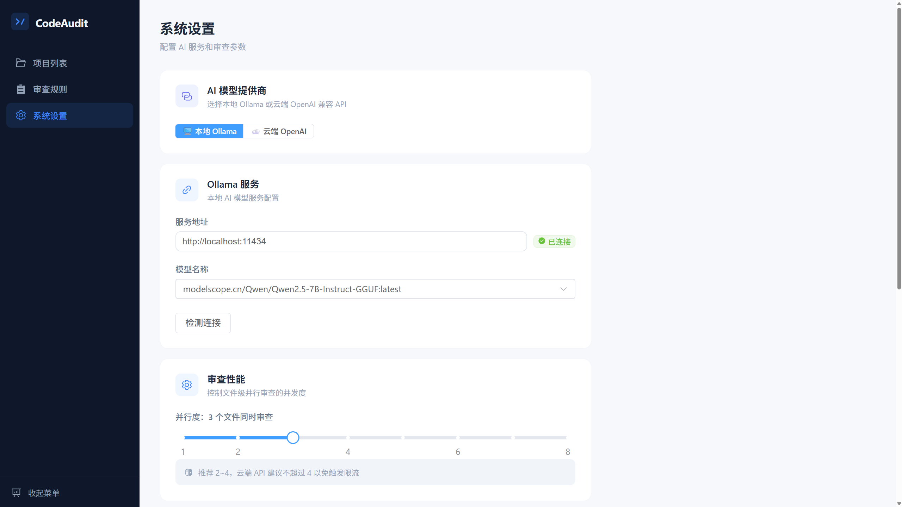

# CodeAudit — Local-First AI Code Review Platform

<p align="center">
  
</p>

A **fully local-first** AI code review tool. Your source code never leaves the intranet — review Git diffs via local Ollama or cloud OpenAI-compatible APIs, with all results displayed and tracked in a web-based dashboard.

> **Current version**: v0.1.0 (MVP)

---

## ✨ Features

| Module | Description |
|--------|-------------|
| 📦 Git Integration | Scan local Git repositories and extract diffs between branches or commits |
| 🔍 AI Code Review | Feed diffs to an LLM file by file, returning structured issues (HIGH / MEDIUM / LOW) |
| 📊 Web Dashboard | Project CRUD, review history, report details, and issue status management |
| 📏 Rule Engine | Built-in preset rules + custom Prompt rules with CRUD and enable/disable controls |
| 🎨 Diff Preview | Changed file list, full diff view, and code syntax highlighting |
| 🌐 Multi-language | Java / Python / Go / JavaScript / TypeScript / C / C++ and more |
| 🤖 Multi-model | Local Ollama + cloud OpenAI-compatible APIs (DeepSeek, Bailian, etc.) |
| ⚡ Parallel Review | Concurrent AI calls per file, configurable parallelism (1–8) |
| 🎯 Issue Tracking | Mark issues as resolved or ignored, with filtering and export support |

---

## 🏗️ Tech Stack

### Backend

| Tech | Version | Purpose |
|------|---------|---------|
| Spring Boot | 3.2.5 | Application framework |
| Spring AI | 1.0.0-M6 | Ollama / OpenAI integration |
| JPA (Hibernate) | — | Data persistence |
| JGit | 6.9.0 | Git repository operations |
| MySQL | 8.0+ | Data storage |

### Frontend

| Tech | Version | Purpose |
|------|---------|---------|
| Vue 3 | 3.5 | Frontend framework |
| Element Plus | 2.14 | UI component library |
| highlight.js | 11.11 | Code syntax highlighting |
| Axios | 1.16 | HTTP client |
| TypeScript | 6.0 | Type safety |

---

## 🚀 Quick Start

### Prerequisites

- **JDK** 17+
- **Maven** 3.8+
- **Node.js** 18+
- **MySQL** 8.0+
- **Ollama** (for local models) or an OpenAI-compatible API key

### 1. Clone the repository

```bash
git clone <your-repo-url>
cd code-aduit
```

### 2. Start Ollama (optional, for local models)

```bash
ollama serve
ollama pull qwen3:8b
```

### 3. Configure environment variables

Create a `.env` file or set system environment variables:

```env
# MySQL
MYSQL_URL=jdbc:mysql://localhost:3306/codeaudit?useSSL=false&serverTimezone=Asia/Shanghai
MYSQL_USERNAME=root
MYSQL_PASSWORD=your_password

# Ollama (for local models)
OLLAMA_BASE_URL=http://localhost:11434
OLLAMA_MODEL=qwen3:8b
OLLAMA_TEMPERATURE=0.1
OLLAMA_TOP_P=0.9

# OpenAI (optional, for cloud API)
OPENAI_API_KEY=sk-xxxxx
OPENAI_BASE_URL=https://api.openai.com
OPENAI_MODEL=gpt-4o
```

### 4. Start the backend

```bash
cd server
mvn spring-boot:run
```

The backend runs on `http://localhost:9090`.

### 5. Start the frontend

```bash
cd web
npm install
npm run dev
```

The frontend runs on `http://localhost:5173` with API proxy pre-configured.

### 6. Log in

Visit `http://localhost:5173` and log in with the default admin credentials:

```
Username: admin
Password: admin
```

---

## 📖 User Guide

### 1. Add a Project

Go to **Projects**, click **New Project**, and fill in:

- **Project Name**: any display name
- **Repo Path**: absolute path to a local Git repository (e.g., `/home/user/my-app`)
- **Language**: Java / Python / Go / etc.

<p align="center">
  
</p>

### 2. Create a Review

Open a project and click **New Review**:

- Select the branch or commit range to compare
- Click **Preview Changes** to see the list of files to be reviewed
- Submit the review — the system will run AI analysis asynchronously in the background

### 3. View Results

After the review completes, click the review entry to open the details page:

- Browse all issues with severity statistics (HIGH / MEDIUM / LOW)
- Click an issue to view details and fix suggestions
- Mark issue status (resolved / ignored)

<p align="center">
  
</p>

### 4. Rule Management

Go to **Rules**:

- View and manage the rules used by AI review
- Add custom rules (name, category, language, prompt description)
- Enable / disable rules

<p align="center">
  
</p>

### 5. System Settings

Go to **Settings**:

- Switch AI provider: local Ollama / cloud OpenAI-compatible API
- Model selection: auto-fetch installed Ollama model list
- Configure parallelism, temperature, and other parameters
- Check Ollama connection status

<p align="center">
  
</p>

---

## 📁 Project Structure

```
code-aduit/
├── server/                          # Spring Boot backend
│   └── src/
│       ├── main/java/com/codeaudit/
│       │   ├── common/              # Utilities (Response, BizException)
│       │   ├── config/              # Configs (Async, GlobalException, Web)
│       │   ├── controller/          # REST controllers
│       │   ├── dto/                 # Data transfer objects
│       │   ├── entity/              # JPA entities (Project, Review, Issue, Rule)
│       │   ├── repository/          # Data access layer
│       │   └── service/             # Business logic
│       └── resources/
│           ├── application.yml      # Main config
│           └── db/data.sql          # Seed data
├── web/                             # Vue 3 frontend
│   └── src/
│       ├── api/                     # API client
│       ├── components/              # Shared components
│       ├── router/                  # Route config
│       ├── utils/                   # Utilities
│       └── views/                   # Pages
│           ├── Projects.vue         # Project list
│           ├── Reviews.vue          # Review list + creation
│           ├── ReviewDetail.vue     # Review details
│           ├── Rules.vue            # Rule management
│           └── Settings.vue         # System settings
└── doc/                             # Design docs
```

---

## 🔌 API Reference

### Projects

| Method | Path | Description |
|--------|------|-------------|
| `GET` | `/api/projects` | List projects (search + pagination) |
| `POST` | `/api/projects` | Create a project |
| `GET` | `/api/projects/{id}` | Get project details |
| `PUT` | `/api/projects/{id}` | Update a project |
| `DELETE` | `/api/projects/{id}` | Delete a project (cascade) |
| `GET` | `/api/projects/{id}/branches` | List branches |
| `GET` | `/api/projects/{id}/commits` | Recent commits |
| `GET` | `/api/projects/{id}/diff-preview` | Preview file changes |

### Reviews

| Method | Path | Description |
|--------|------|-------------|
| `GET` | `/api/projects/{projectId}/reviews` | Review history (paginated) |
| `POST` | `/api/projects/{projectId}/reviews` | Create a review (async) |
| `GET` | `/api/reviews/{id}` | Review details |
| `POST` | `/api/reviews/{id}/cancel` | Cancel a review |
| `DELETE` | `/api/reviews/{id}` | Delete a review |
| `GET` | `/api/reviews/{reviewId}/issues` | List issues (paginated) |
| `PUT` | `/api/issues/{id}/status` | Update issue status |

### Rules

| Method | Path | Description |
|--------|------|-------------|
| `GET` | `/api/rules` | List rules |
| `POST` | `/api/rules` | Create a rule |
| `PUT` | `/api/rules/{id}` | Update a rule |
| `PUT` | `/api/rules/{id}/toggle` | Enable / disable a rule |
| `DELETE` | `/api/rules/{id}` | Delete a rule |

### Settings

| Method | Path | Description |
|--------|------|-------------|
| `GET` | `/api/settings` | Get current config |
| `PUT` | `/api/settings` | Save config |
| `GET` | `/api/ollama/check` | Check Ollama connectivity |
| `GET` | `/api/ollama/models` | List installed Ollama models |

---

## ⚙️ Configuration

The AI provider is controlled via `codeaudit.ai.provider`:

- `ollama` (default) — use local Ollama; requires `spring.ai.ollama.*`
- `openai` — use cloud OpenAI-compatible API; requires `codeaudit.ai.openai.*`

You can switch providers at runtime on the **Settings** page. Changes take effect immediately but revert to config file values on restart.

---

## 🧪 Development

### Backend tests

```bash
cd server
mvn test
```

### Frontend type check

```bash
cd web
npx vue-tsc --noEmit
```

---

## 🤝 Contributing

Please read [CONTRIBUTING.md](CONTRIBUTING.md) and [CODE_OF_CONDUCT.md](CODE_OF_CONDUCT.md) for details.

---

## 📝 License

MIT
